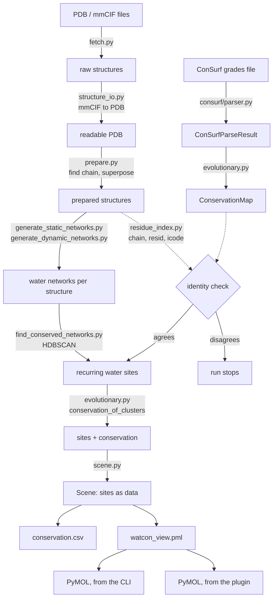

# Architecture

How the pieces fit together, and the four rules that explain most of the design
decisions. Read this before [CODE_MAP.md](CODE_MAP.md), which tells you where
each piece lives.

---

## What the tool does, in one paragraph

WatCon finds water positions that recur across many crystal structures of a
protein — *structural* conservation. ConSurf scores how conserved each residue
is across evolution — *evolutionary* conservation. This package joins the two
and reports them as two columns, so you can ask whether recurring water sites
are lined by conserved residues. The join is the whole job, and getting the join
right is harder than it looks.

---

## The pipeline



For a family, `family.py` and `family_sites.py` sit between the per-protein
steps and the scene: one `ConservationMap` per protein, all placed on a shared
alignment by `alignment.py`, pooled onto alignment columns, then superposed and
clustered together.

---

## The four invariants

Almost every design decision follows from one of these.

### 1. Identity, never position

Every join is keyed on **`(chain, resid, icode)`**. Never on an array index,
never on a residue's position in a list.

This is the defect the fork exists to fix. Upstream assigns each residue an
alignment column with `MSA_indices[resid - 1]` — arithmetic that is only correct
when numbering starts at 1 with no gaps. When it is wrong it returns a real
column for the wrong residue: no error, no warning. On the authors' own TPI
dataset it maps 11.2% of residues correctly; on a raw PDB entry, 0%.

**Consequences you will see all over the code:** `residue_index.py` exists at
all; `ConservationMap` is a dict keyed on a tuple rather than a list;
`alignment.py` maps structures to alignment rows by *sequence* rather than by
counting; `atom_identity()` is the single place the chain is read, so the two
readers cannot drift apart.

### 2. Refuse rather than guess

Where a mismatch would produce a confidently wrong answer, the run **stops**.

`enforce_identity()` compares the amino acid at every matched residue against
what ConSurf scored there. Below 95% agreement it raises:

```
ConSurf data does not describe 2F56.pdb: only 2 of 106 compared residues
agree (1.9%, threshold 95%). ... A3: structure has ASN, ConSurf has VAL
```

It is a **rate**, not a pass/fail, because a point mutant genuinely differs at
one position (99.1%) while a numbering offset collapses to 2.8%.

Where ambiguity is legitimate, it warns instead and says what it assumed — a
ConSurf run covering one chain of a multi-chain structure has low coverage and
is perfectly correct. Coverage of *zero* is never legitimate, so that warns
loudly in the single-protein paths and raises in the family path, where a member
was listed precisely so its conservation would be pooled.

**The one thing the tool will never do is silently attach a score to the wrong
residue.**

### 3. Two columns, never one

Structural occupancy and evolutionary conservation stay **separate columns** in
every output. There is no combined score.

They measure different things, they are correlated, and the relationship between
them is the science — so blending them into one number would bury the question
the tool exists to ask. Where a family result pools across runs it counts
*verdicts* (`unanimous_conserved`: every run graded this column 8 or 9) rather
than averaging scores, because ConSurf normalises within each run and the raw
values were never on a common scale.

### 4. One scene, two renderers

`scene.py` turns an analysis into plain data — sites, their conservation, and
the PyMOL commands that would draw them. The command line writes that to a
`.pml`; the plugin runs the identical file.

They cannot disagree about what a result looks like, because there is only one
description of it. When this was not true, the plugin ran `@<path>` on a `.pml`
that `build_scene` had never written.

---

## Walking one run

`watcon demo` end to end, with the module doing each step:

| Step | Module | What happens |
|---|---|---|
| 1 | `prepare.py` | find the barnase chain in each of six structures (it is chain **L** in 1BRN), superpose on the reference, keep the waters |
| 2 | `consurf/parser.py` | parse the grades file into records with provenance |
| 3 | `evolutionary.py` | build a `ConservationMap`; check every structure really is barnase |
| 4 | `generate_static_networks.py` | build a water network per structure |
| 5 | `find_conserved_networks.py` | pool 671 water coordinates, HDBSCAN into 193 sites |
| 6 | `evolutionary.py` | join sites to conservation: 190 occupied, 165 carry a score |
| 7 | `scene.py` | describe the result as `Site` objects |
| 8 | `view.py` | write `conservation.csv`, two PDBs, and `watcon_view.pml` |

---

## Layering, and what depends on what

```
consurf/          no dependencies beyond the standard library
   ↓
residue_index     MDAnalysis (optional at import), the join key
   ↓
evolutionary      the join itself
   ↓
alignment → family → family_sites          the family path
   ↓
scene → view / family_scene / pymol_plugin  presentation
   ↓
cli                                         what a user types
```

The arrow direction matters: **nothing lower imports anything higher.** The
parser knows nothing about water networks; `scene.py` knows nothing about
PyMOL's Python API; the plugin adds no analysis of its own.

`generate_static_networks.py` and `generate_dynamic_networks.py` sit alongside
this as inherited code that our layers call into.

---

## Deliberate non-goals

Things the tool will not do, each for a reason:

- **No combined conservation score.** See invariant 3.
- **No contacting the ConSurf server.** There is no public API, and scraping the
  web form would be fragile and unwelcome. You supply the files;
  `evolutionary.find_consurf_file` marks where an official API would attach.
- **No guessing a numbering offset.** A renumbered copy must be declared by the
  user, with the offset recorded in the file, not inferred.
- **No treating a crystal ensemble as a trajectory.** Each entry resolves a
  different number of waters, so no constant atom count exists. The static path
  handles such a set; the dynamic path refuses it and says so.

---

## Where the bodies are buried

Failure modes worth knowing before you change anything. Each was a real defect;
the changelog has the full account.

| Trap | What happens if you get it wrong |
|---|---|
| chain read from `segid` instead of `chainID` | every conservation lookup misses, silently — 0 of 127 atoms scored, run reports success |
| coverage of zero | `enforce_identity` has nothing to compare, so it passes vacuously |
| `MSA_indices[resid - 1]` | a real alignment column, for the wrong residue |
| `mol.atoms` on a water residue | brings back the alternate conformers you just filtered out |
| a `;` inside a `#` comment in a `.pml` | PyMOL splits on it and runs the prose as Python |
| pairing two ConSurf runs by position | half the compared pairs are different amino acids, and you invent a noise floor that is not there |

---

## Testing shape

795 tests from a checkout, 569 from an installed wheel — the difference is ten
modules that need raw data a distribution deliberately does not carry, and the
suite says so rather than skipping in silence.

Tests are named as sentences describing the behaviour
(`test_a_member_whose_run_matches_nothing_is_refused`), and modules that exist
for one defect carry a docstring explaining it. Reading the tests is a
reasonable way to learn the failure modes.
